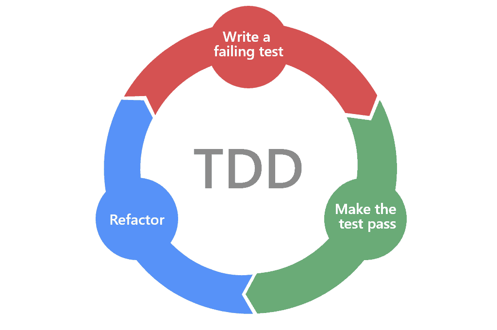
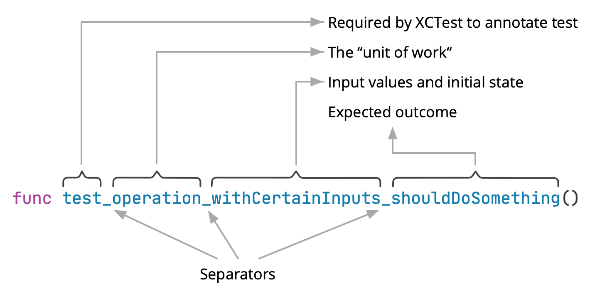

# 테스트 주도 개발(Test Driven Development)



## 유닛 테스트(Unit Test)

유닛 테스트란 컴퓨터 프로프그래밍에서 소스코드의 특정 모듈이 의도된 대로 정확히 작동하는지 검증하는 절차입니다. 즉 모든 함수와 메서드에 대한 테스트 케이스를 작성하는 절차를 말합니다.

## TDD의 세 가지 원칙

1. 실패하는 단위 테스트를 작성할 때까지 실제 코드를 작성하지 않습니다.
2. 컴파일은 실패하지 않으면서 실행이 실패하는 정도로만 단위 테스트를 작성합니다.
3. 현재 실패하는 테스트를 통과할 정도로만 실제 코드를 작성합니다.

테스트 코드는 실제 코드 못지않게 중요합니다. 그러므로 테스트 코드도 실제 코드 못지않게 깨끗하게 작성해야 합니다. 테스트는 코드에 유연성과 유지보수성 그리고 재사용성을 제공합니다. 왜? 테스트 케이스가 있으면 변경이 두렵지 않으니까요. 변경이 두렵지 않으면 더 좋은 코드로 변경하는 것을 주저하지 않습니다.

🤔 테스트 당 assert 문은 하나로 제한하는 것이 좋을까요? 여러 assert를 사용하도록 하는 것이 좋을까요?

- assert 문이 하나라면 하나의 테스트를 이해하는 것이 수월하다는 장점이 있지만 중복되는 코드가 많아질 수 있습니다.
- 하나의 개념 당 assert 문 수를 최소로 줄이고, 테스트 함수 하나는 개념 하나만 테스트하는 것이 좋습니다.

## F.I.R.S.T. 원칙

- Fast, 빠르게: 테스트는 빨라야 합니다.
- Independent, 독립적으로: 각 테스트는 서로 의존하면 안 됩니다.
- Repeatable, 반복 가능하게: 테스트는 어떤 환경에서도 반복 가능해야 합니다. 실제 환경, QA 환경, 네트워크가 연결되지 않은 컴퓨터에서도 실행할 수 있어야 합니다.
- Self-Validating, 자가검증하는: 테스트는 bool 값으로 결과를 내야 합니다.
- Timely, 적시에: 테스트는 적시에 작성해야 합니다. 테스트를 먼저 작성하고 실제 코드를 구현해야 합니다.

### SUT(System Under Test)

테스트 대상 시스템, 즉 테스를 하려는 대상을 칭합니다.

- Fake Object
- Dummy Object
- Mock Object
- Temporary Test Stub
- Test Stub
- Test Spy

### 유닛 테스트 스타일

- Given -> When -> Then
    - Given은 테스트 시나리오에서 수행할 동작을 시작하기 전에 상태를 말합니다. 테스트의 사전 조건으로 볼 수 있습니다.
    - When은 테스트 수행할 동작을 말합니다.
    - Then은 수행한 동작으로 인해 예상되는 변경을 말합니다. 테스트가 예상한 대로 동작하는지 확인합니다.
- Arrange -> Act -> Assert
- Setup -> Exercies -> Verify

### 테스트 메서드명 작성 기준

- test: test 접두사로 시작해야 테스트 메서드로 인식합니다.
- unit of work: 행위를 작성합니다.
- state: 입력값과 초기 상태를 작성합니다.
- outcome: 예상하는 결과값을 작성합니다.
- 각 명칭 사이에 '_' 를 사용하여 구분합니다.



테스트를 작성할 때 테스트에게 비교하는 요구하는 구문을 작성하니 좋지 않은 테스트라고 생각이 들었습니다. output 결과에 대해 일반화할 수 없었기 때문입니다.

```swift
// 테스트가 결과를 직접 비교하는 구문
XCTAssertTrue(output[0] > output[1])
```

다음과 같이 작성하니 테스트를 일반화할 수 있어 더 범용적이라고 생각이 들었습니다.

```swift
XCTAssertTrue(solution.isSameScore(output))
```

### 네트워크에 강하게 의존하고 있을 때, F.I.R.S.T. 원칙 중 Repeatable 원칙을 지키는 테스트를 작성하기 위해서는?

네트워크나 여러 사이트 이펙트에 강하게 커플링이 되어있는 객체를 가지고 테스트를 할 때, 외부에서 가짜 데이터를 제공하는 어떤 스텁이나 목객체를 넣고 동작을 테스트하는 것이 테스트 기법의 하나입니다.

### 참고 링크

---

> [테스트 주도 개발](https://book.naver.com/bookdb/book_detail.nhn?bid=7443642)
>
> [Clean Code](https://book.naver.com/bookdb/book_detail.nhn?bid=7390287)
>
> [Unit Testing](https://en.wikipedia.org/wiki/Unit_testing)
>
> [Martin Fowler GivenWhenThen](https://martinfowler.com/bliki/GivenWhenThen.html)
>
> [xUnit Patterns Four-Phase Test](http://xunitpatterns.com/Four%20Phase%20Test.html)
>
> [YouTube Let's TDD - 전수열](https://www.youtube.com/watch?v=meTnd09Pf_M)